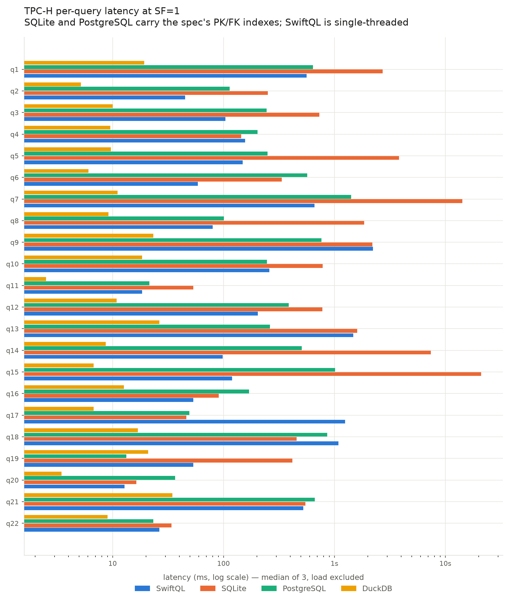
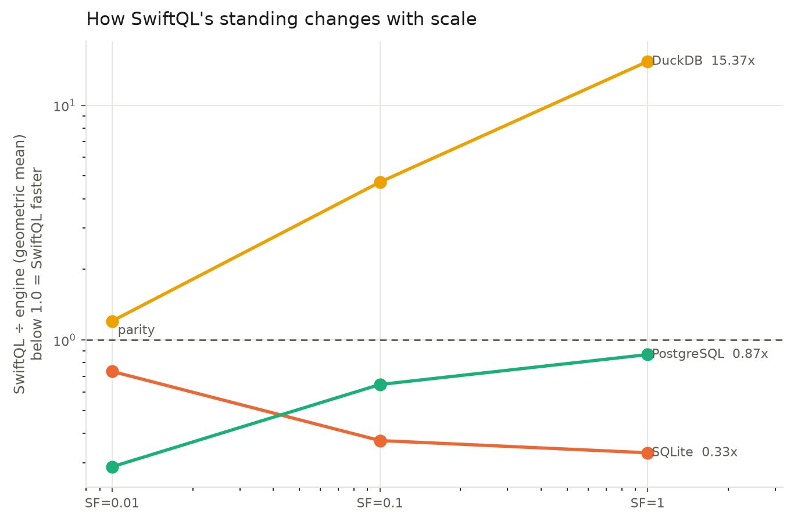
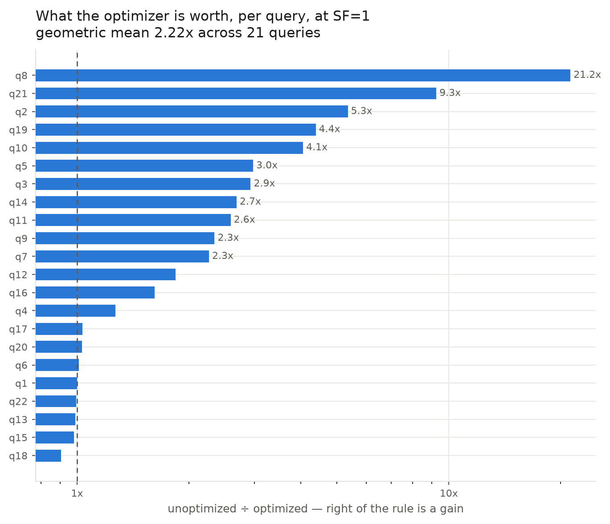
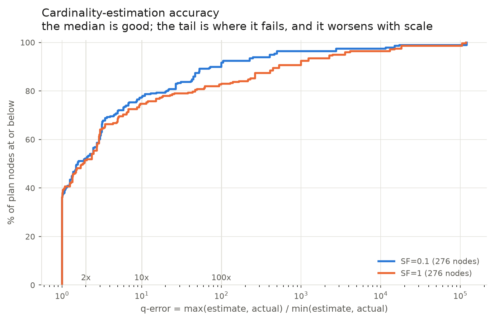

# SwiftQL: A Single-Threaded Columnar Query Engine, Measured Against Production Systems on TPC-H

## Abstract

We present SwiftQL, a columnar, vectorized SQL engine written from scratch in
C++ over 37 weeks, and evaluate it on TPC-H against SQLite, PostgreSQL and
DuckDB at three scale factors. SwiftQL supports a documented subset of SQL —
multi-way joins, left outer joins, correlated and uncorrelated subqueries,
derived tables, and grouped aggregation — and answers all 22 TPC-H queries. On
official `dbgen` data all 22 queries match **the published TPC-H answer set** at
SF=1, and at SF=0.1 and SF=1 all 22 also match SQLite and survive a mutation
check that neuters each query's characteristic predicate, so no query is counted
as correct while asserting nothing. Adding the published answers as a second,
independent oracle immediately found two defects in our own query port that
SQLite could not detect, because SQLite executed the same ported text. On latency, SwiftQL
is **3.0× faster than SQLite** and **1.15× faster than PostgreSQL** at SF=1 by
geometric mean, rising to **2.0× against PostgreSQL restricted to one core**;
against DuckDB it is **15.4× slower**, a gap that widens monotonically with scale
and is attributable to parallelism, which SwiftQL does not implement. Its
cost-based optimizer is worth **2.22×** at SF=1 and improves 17 of 21 queries.

The evaluation's main contribution is methodological. We show that three
measurement artifacts, each individually capable of inverting the headline
result, dominated our first numbers: an unset CMake build type that made every
prior benchmark a `-O0` measurement (~21×), PostgreSQL's default parallelism
(1.73×), and the absence of the specification's own indexes on the row stores
(up to 3 860× on a single query). We report each control separately and publish
the configurations that produce each number.

---

## 1. Introduction

Analytical query engines are usually evaluated by their authors against
themselves. A new engine is compared to its own previous version, or to a
baseline configured by the people who benefit from that baseline being slow.
This paper takes the opposite posture: SwiftQL is a student-scale engine, and we
measure it against three production systems under conditions chosen to be
unfavourable to us.

**The system.** SwiftQL executes SQL over a columnar store with a vectorized,
chunk-at-a-time execution model (1024-row `DataChunk`s over 8192-row storage
chunks), a logical plan layer, a cost-based optimizer with cardinality
estimation and dynamic-programming join ordering, and two execution backends
(Volcano row-at-a-time and vectorized). It has no write path, no persistence
beyond CSV, no indexes of any kind, and runs on a single thread.

**The evaluation.** We use the official TPC-H `dbgen` V3.0.1 tool at SF=0.01,
SF=0.1 and SF=1. Every engine executes the *same query text* — the SwiftQL
dialect port — under the same type mapping. SQLite and PostgreSQL are given the
specification's own PRIMARY and FOREIGN key indexes plus statistics. Load time
is excluded for all engines.

**The contributions are three.**

1. *A correctness result that is hard to inflate.* 22/22 queries match SQLite at
   SF=0.1 and SF=1, and 22/22 survive a mutation check: for each query we neuter
   the one predicate carrying its characteristic feature and require the answer
   to change. A query that matches while asserting nothing is counted separately
   and never folded into the headline.
2. *A performance result with its confounds separated.* We report PostgreSQL
   twice (default and single-threaded) and the row stores twice (indexed and
   unindexed), because each of those choices moves the result by more than the
   result itself.
3. *A negative-results record.* We publish the optimizations that did not work,
   the design we specified and then measured to be worse, and the three
   measurement bugs we found in our own instrumentation.

---

## 2. System Overview

SwiftQL compiles a query through five stages: lexer and recursive-descent parser
→ binder (resolving column references to relation slots) → validator → logical
plan with optimization passes → physical plan for one of two executors.

**Storage.** Tables load into a columnar layout with run-length and dictionary
encodings applied per column, plus per-chunk min/max *zone maps* over 8192-row
chunks. There is exactly one access path: a sequential scan that consults the
zone maps to skip chunks whose min/max prove no row can match.

**Execution.** The vectorized backend passes `DataChunk`s between operators and
uses *late materialization*: a filter produces a selection vector over its
child's chunk rather than copying rows. Joins are hash joins with a SIMD
loop-join alternative for small build sides, chosen by the cost model.

**Optimization.** Predicate pushdown, projection pushdown, constant folding,
cardinality estimation from catalog statistics, dynamic-programming join
ordering bounded by the written order, and subquery rewriting: uncorrelated
scalar and `EXISTS` subqueries are materialized to constants, `IN` lowers to a
hash semi-join, correlated `EXISTS`/`NOT EXISTS` decorrelate to semi/anti joins,
and a correlated scalar subquery over an aggregate decorrelates to a `GROUP BY`
derived relation left-joined back.

**What it deliberately lacks.** No B-tree or any other index; no parallelism; no
write path; no spilling. Section 6 shows that the first two account for
essentially all remaining distance to the systems we compare against.

---

## 3. Evaluation Methodology

Methodological choices decide benchmark results more often than engine quality
does. We state ours, and we state which way each one cuts.

**One query text for all engines.** Every engine runs the string our TPC-H port
produces. This cuts *against* SwiftQL: the port exists because SwiftQL cannot
parse the specification's own SQL, so the other three systems are handed a query
shaped by a dialect they do not need.

**One type mapping.** All engines receive `INTEGER`/`REAL`/`TEXT` declarations.
Dates are lexicographically-compared strings everywhere, matching SwiftQL's
internal representation. Allowing PostgreSQL a native `DATE` and `NUMERIC` would
measure a different query.

**Indexes: the specification's own.** SQLite and PostgreSQL are given exactly the
PRIMARY and FOREIGN keys declared in `dbgen/dss.ri`, plus `ANALYZE`. This set is
**query-blind**: it was fixed by the benchmark's authors before we chose a query,
where an index set derived by reading the 22 queries would be tuning, and tuning
one engine and not others voids the comparison. DuckDB and SwiftQL receive none;
both prune with automatic min/max metadata instead, which is what their designs
call for.

**Load excluded, and excluded differently.** SQLite, PostgreSQL and DuckDB load
once into a persistent database and are timed on execution. SwiftQL has no
persistence — every invocation re-reads and re-parses the `.tbl` files — so it is
timed from its own `--explain-analyze` footer, whose timers begin after the load.
We verified the exclusion directly: 1.56 s of wall clock against a reported
17.7 ms on the same query. Including SwiftQL's load would measure a CSV parser
against three storage engines; excluding it hides that SwiftQL takes 36.8 s to
*start* a query at SF=1, which Section 7 records as a system-level limitation.

**Statistic.** Median of 5 repetitions (3 at SF=1) after one discarded warmup.
Machine: Apple silicon, 14 cores, 24 GB, macOS. Aggregates are **geometric
means**, because the per-query ratios span four orders of magnitude and an
arithmetic mean over them is decided by one query.

**Correctness oracles, two of them.** SQLite over the same files, and — since
the data is produced by official `dbgen` V3.0.1 at SF=1 — **the published TPC-H
answer set itself** (`dbgen/answers/*.out`, using the specification's
qualification parameters). Section 4.1 reports the second, which is what
upgrades the claim from "matches SQLite" to "matches the published answers", and
which found two defects SQLite structurally could not.

---

## 4. Correctness

| dataset | modes | meaningful | vacuous |
|---|---|---|---|
| `dbgen-sf0.01` | 4 | 20/22 | q16, q17 |
| **`dbgen-sf0.1`** | 2 | **22/22** | none |
| **`dbgen-sf1`** | 2 | **22/22** | none |

### 4.1 Against the published answer set

**All 22 queries match the official TPC-H answers at SF=1**, bit-for-bit within
the answer files' two-decimal rounding, using the specification's own
qualification parameters.

Reaching that number required fixing **two defects in our query port, not in the
engine**, and the way they were found is the point. SQLite had been our only
oracle, and SQLite ran *the same ported text we did* — so on both queries it
returned answers byte-identical to SwiftQL's while both differed from the
specification. An oracle that shares your query text cannot check your query
text.

- **q19** rendered `l_shipmode IN ('AIR', 'REG AIR')`. The specification writes
  `('AIR', 'AIR REG')`, and `AIR REG` matches no value `dbgen` produces. Our port
  had silently repaired what looks like a typo in the specification, admitting a
  whole shipmode and roughly doubling the answer: 6 388 788.11 against the
  published 3 083 843.06.
- **q20** replaced the specification's correlated availability test —
  `ps_availqty > (SELECT 0.5 * SUM(l_quantity) ... WHERE l_partkey = ps_partkey
  AND l_suppkey = ps_suppkey AND l_shipdate >= ...)` — with the constant
  predicate **`ps_availqty > 0`**, which is trivially true. That is not a dialect
  port; it deletes the query's central feature, and it returned 233 rows against
  the published 186. The engine was never the obstacle: given the specification's
  actual predicate, SwiftQL returns exactly 186. The mutation check had reported
  q20 as discriminating because neutering the *nested `IN`* changed the answer,
  so a weakened query passed a check designed to catch weakened queries.

Both are now fixed and the mutation target for q20 is the availability test.
**We report this because it revises a claim we had already published**: the
earlier "22/22 meaningful" counted a q20 that did not test what Q20 tests.

---

"Meaningful" means the query matched SQLite **and** survived mutation. The
mutation check names, per query, the one predicate carrying its characteristic
feature — q21's `NOT EXISTS` anti-join, q17's correlated scalar subquery, q14's
`CASE` arm — neuters it, and requires the answer to change. This bounds the
headline figure *from above*: it proves the data makes the feature selective, not
that SwiftQL's plan used it.

Two findings follow from the table. First, q16 and q17's vacuity at SF=0.01 is a
**scale** artifact rather than a parameter one: both already use spec-literal
parameters, and 100 suppliers and 2 000 parts are too few for
`%Customer%Complaints%` and `Brand#23 / MED BOX` to select anything. Both recover
at SF=0.1. Second, "22/22" is **two modes, not four**. SwiftQL's row-at-a-time
Volcano backend builds exactly one join, so 17 of the 22 queries refuse on that
path by design. Reporting 22/22 without that split would claim coverage the
engine does not have.

---

## 5. Performance

Geometric mean of SwiftQL ÷ engine; **below 1.0 means SwiftQL is faster**.

| | SF=0.01 | SF=0.1 | SF=1 |
|---|---|---|---|
| vs **SQLite** | 0.74× | 0.37× | **0.33× (3.0× faster)** |
| vs **PostgreSQL**, default | 0.29× | 0.65× | **0.87× (1.15× faster)** |
| vs **PostgreSQL**, 1 thread | — | — | **0.49× (2.0× faster)** |
| vs **DuckDB** | 1.20× | 4.70× | 15.37× |
| optimizer (`--no-optimize` ÷ optimized) | 1.69× | 1.92× | **2.22×** |
| queries won vs SQLite | 9/22 | 15/22 | 17/21 |

*Figure 1 — per-query latency at SF=1, log axis. The distribution is heavily
skewed: SwiftQL's wins are large and its losses are moderate, which is why the
geometric mean sits at 0.33× rather than in the tens.*

*Figure 2 — how each ratio moves with scale. SwiftQL gains on SQLite, gains on
PostgreSQL, and loses ground to DuckDB, monotonically in all three cases.*

*Figure 3 — optimizer impact per query at SF=1. Bimodal: a query either has a
rewritable shape or it does not.*

*Figure 4 — cardinality-estimation accuracy. The medians are close; the SF=1
curve falls below the SF=0.1 curve in the tail, which is the independence
assumption compounding along a join spine.*

**SwiftQL's position against SQLite improves monotonically with scale**, from
0.74× to 0.33×. The mechanism is visible per query: scan-and-hash work is linear
in rows, while SQLite's per-row index traversal degrades on large joins. The
largest SF=1 wins are q14 (69.5×), q15 (66.9×), q5 (17.7×) and q7 (16.6×) — all
single-pass aggregations or joins over `lineitem`.

**Against PostgreSQL the interesting number is the pair.** At its default
configuration PostgreSQL uses up to two parallel workers, and every TPC-H table
above 8 MB qualifies; at SF=1 it is therefore running on up to three processes
against SwiftQL's one. Restricted to a single worker, PostgreSQL's own parallel
speedup measures **1.73×**, and SwiftQL's margin doubles from 1.15× to 2.0×. We
publish both: single-threaded is the engine-against-engine comparison, default is
the configuration a user actually runs.

**The DuckDB gap widens by 13× across two orders of magnitude** and SwiftQL wins
9 of 22 queries at SF=0.01 but none at either larger scale. DuckDB uses 14 cores.
We draw no conclusion beyond that.

**The optimizer's contribution grows with scale** and is bimodal per query. At
SF=1 it is worth 21.2× on q8, 9.3× on q21, 5.3× on q2 and 4.4× on q19 — the
queries whose *shape* the planner rewrites — while q1, q6, q13, q15, q18, q20 and
q22 sit at ≈1.0×. There is no middle: a query either has a rewritable shape or it
does not.

**One correctness divergence surfaced from the latency harness.** On q15,
SwiftQL, SQLite and DuckDB return 1 row and PostgreSQL returns 0. The query tests
`total_revenue = (SELECT MAX(total_revenue) ...)` — an exact equality on a
computed `DOUBLE`. PostgreSQL accumulates the sum in a different order, so the row
that should equal the maximum differs in its last bits. The other three agree by
coincidence of summation order, not by contract. q15 is excluded from every
aggregate above, because comparing latencies for different answers is
meaningless.

### 5.1 The unindexed control

Stripping the specification's indexes from the row stores separates access-path
asymmetry from engine quality.

| query | SwiftQL | SQLite | PostgreSQL |
|---|---|---|---|
| q22 | 107 ms | **413 273 ms** | 283 ms |
| q19 | 379 ms | 3 827 ms | 214 ms |
| q18 | 2 718 ms | 1 998 ms | 1 315 ms |

Three readings. **q22 shows the access-path gap in its extreme form**: SQLite
without an index takes 6.9 minutes for a single execution of a query SwiftQL
answers in 107 ms, because the correlated `NOT EXISTS` becomes a nested scan
where SwiftQL's planner rewrites it to an anti-join. **q19 confirms the
diagnosis independently**: PostgreSQL is 13.6 ms indexed and 214 ms unindexed, a
16× difference, so its win on that query is the index rather than the engine.
**q18 is the counterexample**, and we publish it as one: unindexed PostgreSQL
still beats SwiftQL, 1 315 ms against 2 718 ms. That loss is engine quality.

---

## 6. Technical Challenges

### 6.1 Three measurement artifacts, each able to invert the headline

**An unset build type made every prior benchmark a `-O0` measurement.** CMake
passes no `-O` flag when `CMAKE_BUILD_TYPE` is empty, and it was empty. Same
commit and data, q18 ran 1 568 ms against 72 ms Release, and q1 260 ms against
9 ms — a ~21× factor with no source change behind it, which by itself moved the
SQLite comparison from 6.31× slower to 1.9× faster. Nothing about it was visible:
the build succeeds, the tests pass, and the only evidence is an absent flag in
`compile_commands.json`.

**Our profiler was not measuring what its documentation claimed.** Three of six
blocking operators started their timer *before* draining the child, charging the
entire subtree to themselves. On q18 the sort reported 42.4 ms (64.8% of
execution) where its true self-time is 3.0 µs. Every `ORDER BY` query therefore
named the sort as its hot node and hid the real one. Since per-node profiling was
this evaluation's deliverable, the instrument had to be repaired before it could
be used, and every profile taken earlier is wrong.

**The correctness oracle, not the engine, was the scale ceiling.** Our SQLite
mirror was built with no indexes and no statistics. A SF=0.1 correctness run was
killed after 55 minutes inside one query; at SF=1 a six-table join ran 28 minutes
without finishing because the join order was chosen from static heuristics.
Indexing every key-shaped column took SF=0.1 to 177 s, and `ANALYZE` took SF=1's
worst query to 3.1 s. Neither changes an answer — they change which plan produces
it.

### 6.2 Optimizations, including the ones that failed

The engine's blocking operators were **chunk-fed but row-at-a-time inside**:
`VecSortNode`, `VecHashJoinNode` and `VecHashAggregateNode` each held
`std::vector<Row>` and allocated per row, abandoning the late-materialization
principle the execution layer is built on at precisely the three operators that
dominated every slow query. Rebuilding them — a column-wise join build side with
a chained index and late-materialized output, group keys serialized straight from
the column into a reused buffer, and sort keys evaluated once per row rather than
per comparison — reduced total SF=0.1 latency by 26%.

Four planner changes followed, of which one is worth naming: **q19's entire
`WHERE` clause is a single `OR` conjunct**, so predicate pushdown, which splits
on `AND`, pushed nothing. The plan was a 6 M × 200 k hash join with no filter on
either side, evaluating a three-way disjunction over 6 M materialized rows to
return one row; `opt = 1.00×` at every scale factor was the fingerprint. Deriving
the sound-but-weaker single-relation restriction from each disjunct and pushing
*that* below the join cut the join's input from 600 572 to 25 402 rows and the
query from 129.8 ms to 18.2 ms.

**Two efforts did not work, and we report them as such.** A Bloom filter pushed
from the join build side into the probe scan was chosen because the join family
is the top node in 8 of the 10 queries losing to PostgreSQL; of the six targeted
queries only one moved, and the real gains landed on queries SwiftQL was already
winning. And an inline `{key, row}` bucket array specified as the join's hash
layout measured *slower* than the chained index it was meant to replace —
60.3 ms against 44.1 ms — because 16-byte slots at a 0.5 load factor make the
table 4× larger and the build pays for that in full.

**Clustering was measured and rejected.** The natural columnar answer to "no
indexes" is to sort at load so that zone maps prune. We measured the zone maps
directly: every 8192-row chunk's `l_shipdate` range spans the entire seven-year
corpus, so chunk pruning skips *zero* chunks for every date, quantity, discount,
brand and shipmode predicate in TPC-H. Sorting would help only queries SwiftQL
already wins, and no chunk size prunes a chunk whose min/max is the whole domain.

### 6.3 Estimate accuracy

Across 276 plan nodes, the geometric mean q-error is 4.52 at SF=0.1 and 6.59 at
SF=1, with medians of 1.59 and 1.86. Half of all estimates land within a factor
of two. **The failure is in the tail and it worsens with scale**: the 90th
percentile moves from 100× to 533×, which is the independence assumption
compounding along a join spine. One defect is systematic and nameable: semi and
anti joins estimate a single row — q16 estimates 1 against an actual 11 635 —
because the subquery body's projection empties its statistics context and the
distinct-value lookup misses. Estimate accuracy is not plan quality; the
optimizer's measured 2.22× gain is the evidence that ranking still works despite
these errors.

---

## 7. Limitations

**No index of any kind**, and every remaining loss has that shape. SwiftQL has
one access path. Section 5.1 quantifies both directions: indexed row stores beat
it on selective point-lookup queries, and unindexed ones take four orders of
magnitude longer on q22. Closing the gap requires a sorted key-to-row structure,
which is an index in a cheaper form.

**Single-threaded**, against systems that are not. This is most of the DuckDB gap
and all of the PostgreSQL default-configuration gap.

**No persistence.** A single SwiftQL invocation at SF=1 takes 36.8 s of wall
clock while executing in milliseconds, because every process re-reads 1.1 GB of
text. Our reported latencies correctly exclude this, and it is the largest gap
between the *engine* being fast and the *system* being usable.

**Scale ceiling of SF=1** at 5 450 MB peak RSS on a 24 GB machine. SF=10 would
require roughly 55 GB; we do not extrapolate a latency figure from it.

**Not measured at all:** cold start, concurrency, write throughput,
larger-than-memory operation, and multi-user behaviour. Three of those are not
comparisons SwiftQL can enter.

---

## 8. Conclusion

SwiftQL answers all 22 TPC-H queries, matches SQLite on all 22 at two scale
factors with every match mutation-checked, and is 3.0× faster than SQLite and
1.15× faster than PostgreSQL at SF=1 while using one core and no indexes. Its
optimizer is worth 2.22×, and the queries it helps most are the ones whose shape
it rewrites — decorrelation to semi/anti joins, derived-table extraction, and
disjunctive restriction derivation — rather than the ones where it merely
reorders.

The result we consider most transferable is not a speedup. It is that our first
measurement of this system was wrong in three independent ways at once, each
capable of inverting the conclusion, and that none of the three was visible from
the numbers themselves: a build flag, a mis-scoped timer, and a competitor
running on three cores. Benchmarks that report a single ratio without the
configuration that produced it are not reporting a measurement.

---

## Appendix A: Claim–Evidence Map

| Claim | Evidence | Status |
|---|---|---|
| **22/22 match the published TPC-H answer set at SF=1** | `validate_answers.py` vs `dbgen/answers/*.out`, spec qualification parameters | supported |
| Two port defects found by the published answers, not by SQLite | q19 shipmode literal, q20 deleted correlated predicate; SQLite returned SwiftQL's answers on both | supported |
| All 22 queries answered | `run_tpch.py` 22×4 matrix, `docs/week-37-measurements.md` §1 | supported |
| 22/22 meaningful at SF=0.1 and SF=1 | mutation check per query, same table | supported |
| 3.0× faster than SQLite at SF=1 | geomean 0.33× over 21 queries, `week-37-per-query.md` | supported |
| 1.15× faster than default PostgreSQL at SF=1 | geomean 0.87× | supported |
| 2.0× faster than single-threaded PostgreSQL | geomean 0.49×, `week-37-pg-single-threaded-sf1.json` | supported |
| 15.4× slower than DuckDB | geomean 15.37× | supported |
| Optimizer worth 2.22× at SF=1 | `swiftql` vs `swiftql-noopt`, same run | supported |
| `-O0` build cost ~21× | four queries, both builds, byte-identical answers | supported |
| PostgreSQL parallelism worth 1.73× | default vs `max_parallel_workers_per_gather=0` | supported |
| SQLite unindexed q22 takes 6.9 min | one execution, `--reps 1 --warmups 0` | supported |
| Zone maps prune zero chunks on TPC-H | direct measurement of chunk min/max from `dbgen` data | supported |
| Clustering would not help the losing queries | derived from the above plus per-query win/loss | supported |
| q-error geomean 4.52 / 6.59 | 276 nodes, `qerror_tpch.py` | supported |
| SF=10 needs ~55 GB | linear extrapolation from SF=1 peak RSS | **extrapolation, labelled** |
| Remaining PostgreSQL gap is access-path | per-query attribution + unindexed control | supported for q17/q19/q22; q18 is a counterexample and is stated |

## Appendix B: Self-Review

**Contribution.** The engine itself is not novel; the paper's value is the
evaluation discipline and the negative results. Stated as such in §1 rather than
overclaimed.

**Writing clarity.** Terminology fixed throughout: "meaningful" (matched +
mutation-checked), "vacuous", "geometric mean", "q-error". Each is defined at
first use.

**Experimental strength.** Three scale factors, four engines, two controls,
**two independent correctness oracles**, and a mutation check on every
correctness claim. The previously-stated weakness — that SQLite was the only
oracle — is now closed, and closing it immediately found two defects in our own
query port that SQLite could not see. That is the strongest argument in this
paper for not trusting a single oracle, and it cost us a published claim.

**Evaluation completeness.** Cold start, concurrency, writes and
larger-than-memory operation are unmeasured and named in §7. The SF=10 figure is
the only extrapolation and is labelled.

**Method soundness.** The largest threat is that the query text is a dialect
port rather than the specification's SQL. §3 states this and notes it cuts
against SwiftQL. The second threat is that load exclusion flatters an engine with
no persistence; §3 and §7 both state the 36.8 s figure rather than leaving it
implicit.
